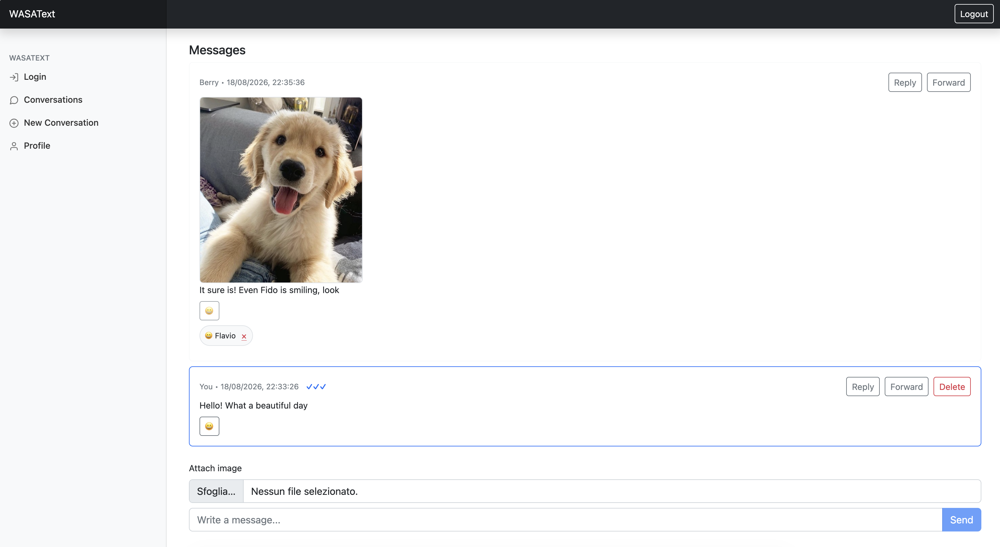

# WASAText

A full-stack messaging web application built with **Go, Vue.js, SQLite, OpenAPI and Docker**.

WASAText implements direct and group messaging, image sharing, replies, forwarding, emoji reactions, delivery/read receipts, user profile management and group administration through a RESTful client-server architecture.

The project was developed for the **Web and Software Architecture (WASA)** course at Sapienza University of Rome with a final project evaluation of 30/30

---

## Screenshot



---

## Overview

WASAText is a single-page messaging application composed of two main parts:

- a **Vue.js frontend** running in the browser;
- a **Go REST API backend** responsible for application logic and persistence.

The frontend communicates with the backend through HTTP requests using JSON representations.

Application data is stored in a relational **SQLite** database.

The project also includes an OpenAPI specification** describing the HTTP API and separate **Docker multi-stage builds for the frontend and backend.

---

## Key Features

### Messaging

- Direct conversations between users
- Group conversations
- Text messages
- Image messages with optional captions
- Replies to existing messages
- Message forwarding
- Soft deletion of messages
- Emoji reactions
- Delivery receipts
- Read receipts

### Group Management

- Create group conversations
- Change group name
- Change group photo
- Add members to a group
- Leave a group

### User Management

- User login
- Change username
- Change profile picture
- Browse users when creating conversations

### Frontend

- Single-page application
- Client-side routing
- Responsive interface
- Reactive UI updates
- Loading and error states
- Automatic conversation refresh through polling
- Image preview before upload

---

## Tech Stack

### Backend

- **Go**
- `net/http`
- `httprouter`
- SQLite
- `database/sql`
- OpenAPI
- Logrus

### Frontend

- **Vue.js 3**
- Vue Router
- Axios
- Vite
- Yarn
- Bootstrap

### Infrastructure

- Docker
- Multi-stage Docker builds
- Nginx
- Debian Linux

---

## Architecture

The application follows a traditional client-server architecture.

```
┌──────────────────────┐
│       Browser        │
│                      │
│     Vue.js SPA       │
└──────────┬───────────┘
           │
           │ HTTP / JSON
           │
           │ Authorization: Bearer <token>
           ▼
┌──────────────────────┐
│      Go REST API     │
│                      │
│ Routing              │
│ Validation           │
│ Authorization        │
│ Application logic    │
└──────────┬───────────┘
           │
           ▼
┌──────────────────────┐
│   Database Layer     │
└──────────┬───────────┘
           │
           ▼
┌──────────────────────┐
│       SQLite         │
└──────────────────────┘

```

The Vue frontend communicates with the backend using **Axios**.

The Go backend exposes the application's REST API, validates incoming requests, performs authorization checks and delegates persistence operations to a dedicated database layer.

---

## Backend Architecture

The backend separates HTTP concerns from persistence logic.

```
cmd/webapi
    │
    ▼
service/api
    │
    ▼
service/database
    │
    ▼
SQLite

```

### `cmd/webapi`

Contains the main executable and server configuration.

It is responsible for:

- loading application configuration;
- initializing logging;
- opening the SQLite database;
- creating the API router;
- registering the web UI;
- applying the CORS policy;
- starting the HTTP server;
- handling graceful shutdown.

### `service/api`

Contains the HTTP API implementation.

Responsibilities include:

- routing;
- request parsing;
- request validation;
- user identification;
- authorization checks;
- HTTP status codes;
- JSON responses;
- conversations;
- groups;
- messages;
- users;
- sessions.

### `service/database`

Encapsulates database access and persistence logic.

Responsibilities include:

- database schema initialization;
- users;
- conversations;
- conversation membership;
- messages;
- reactions;
- delivery receipts;
- read receipts;
- SQL transactions.

---


### Polling

Conversation and message updates are retrieved through periodic HTTP polling.

This keeps conversations synchronized without requiring a persistent WebSocket connection.

---

## Authentication

Authentication was intentionally simplified to match the requirements and scope of the university project.

After login, the backend returns a user identifier.

The frontend stores this value in `localStorage` and an Axios request interceptor automatically includes it in subsequent requests using the HTTP `Authorization` header:

```
Authorization: Bearer <user-identifier>

```

The backend extracts the bearer value and uses it to identify the current user.

This mechanism is intentionally simple and is **not intended to represent production-grade authentication**.

A production system would instead use a secure session or token-based authentication mechanism.

---

## CORS

The backend includes a CORS middleware layer to allow communication between frontend and backend when they are served from different origins.

The configuration allows the HTTP headers required by the application, including:

```
Content-Type
Authorization

```

and the HTTP methods used by the REST API.

---

## Docker

Both frontend and backend are containerized using **multi-stage Docker builds**.

---

## OpenAPI

The API contract is formally documented using **OpenAPI**.

The specification defines:

- endpoints;
- HTTP methods;
- path parameters;
- request bodies;
- response bodies;
- status codes;
- data schemas;
- authentication requirements.

The specification is available at:

```
doc/api.yaml

```

---

## What This Project Covers

WASAText provided practical experience across the complete web application stack, including:

- REST API design and implementation;
- backend development in Go;
- relational database modelling;
- SQL queries and transactions;
- HTTP routing and middleware;
- authorization and request validation;
- JSON serialization;
- OpenAPI specification;
- Vue.js component-based frontend development;
- client-side routing;
- reactive user interfaces;
- asynchronous JavaScript;
- HTTP communication with Axios;
- browser security concepts such as SOP and CORS;
- image handling in web applications;
- Docker containerization;
- multi-stage image builds;
- frontend deployment through Nginx;
- debugging interactions across frontend, backend and persistence layers.

---

## Academic Context

WASAText was developed as part of the **Web and Software Architecture (WASA)** course at Sapienza University of Rome.

The repository originates from the starter project structure provided for the course. Project-specific functionality was implemented as part of the university assignment.

Original copyright notices and licensing terms from the starter repository are preserved where applicable.

---

## License

This repository is distributed according to the terms specified in the `LICENSE` file.

Please refer to that file for the complete licensing information.